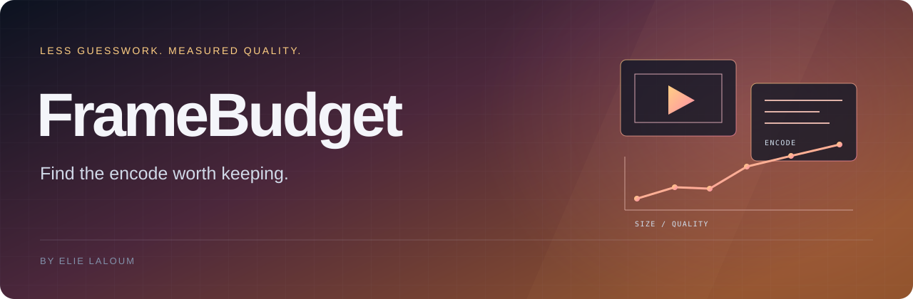

<p align="right"><a href="README.md">English</a></p>


<!-- project badges -->
<p>
<a href="README.md"></a>
<a href="https://github.com/elie-laloum/framebudget/actions/workflows/ci.yml"></a>
<a href="LICENSE"></a>
<a href="README.md#see-it-in-action"></a>
</p>
<p>
<a href="README.md#quick-start"></a>
<a href="README.md#quick-start"></a>
<a href="README.md#quick-start"></a>
</p>
<!-- /project badges -->

# FrameBudget

**Comparez des réglages H.264 sur plusieurs extraits, choisissez un compromis taille–qualité mesuré et vérifiez l’encodage final.**

## Voir la démo

<a href="assets/demo.mp4"></a>

<sub>Démo réellement exécutée, rejouée avec des annotations et un rythme adapté à la lecture.</sub>

[Vidéo MP4](assets/demo.mp4) · [Reproduire la démo](docs/demo.md)

## Essayer la version 0.1

```sh
git clone https://github.com/elie-laloum/framebudget.git
cd framebudget
python -m pip install .
python -m unittest discover -s tests
python examples/demo.py
```

La démonstration génère une vidéo de trois secondes, compare trois réglages avec FFmpeg et VMAF, puis vérifie la qualité du fichier final.

## Utilisation et périmètre

L’outil explore une grille CRF/preset, mesure VMAF ou PSNR et produit un rapport JSON/HTML. FFmpeg, ffprobe et libx264 sont nécessaires ; VMAF nécessite libvmaf. La version 0.1 vise les vidéos SDR avec un seul flux vidéo et une sortie MKV. Les extraits ne garantissent pas la qualité du fichier entier : activez `--verify-quality` pour la mesurer.

[Configuration complète et contrat de l’API](README.md#use-it-on-your-project) · [Limites détaillées](README.md#boundaries) · [Contribuer](CONTRIBUTING.md)

La documentation technique de référence est en anglais. Cette traduction présente le démarrage et le périmètre de la version actuelle.

[GitLab origin](https://gitlab.elielaloum.com/elielaloum/framebudget) · [GitHub mirror](https://github.com/elie-laloum/framebudget)

Le dépôt GitLab privé contient la source de référence ; GitHub en est le miroir public.
